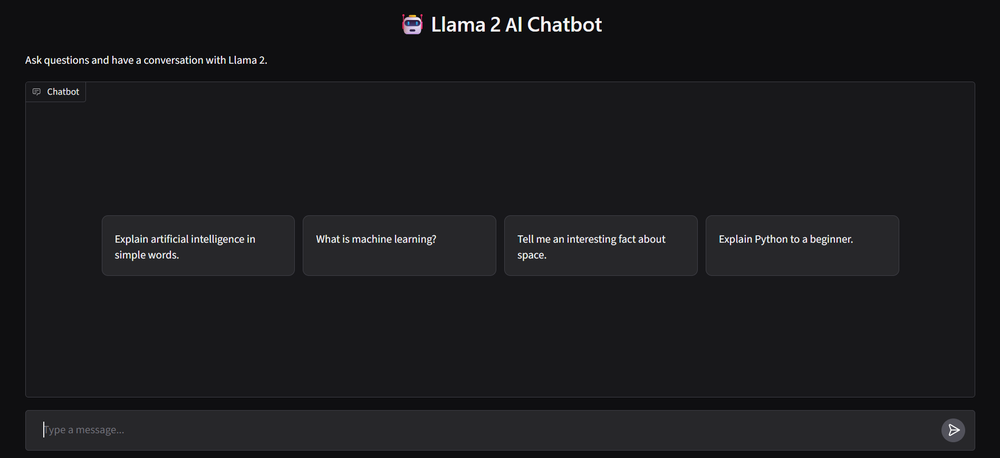

# 🤖 Llama 2 GenAI Conversational Chatbot

A conversational AI chatbot powered by Meta's Llama 2 7B model.

This project uses Hugging Face Transformers and PyTorch to run the Llama 2 language model and Gradio to provide an interactive chatbot interface. The chatbot also maintains conversation context so that users can have a continuous conversation.

---

## 📸 Chatbot Demo



> Screenshot of the working chatbot interface.

---

## ✨ Features

- 🤖 Powered by Llama 2 7B
- 💬 Interactive conversational chatbot
- 🧠 Maintains conversation context
- 🔐 Secure Hugging Face authentication
- ⚡ GPU acceleration
- 🌐 Gradio-based web interface
- 💡 Example prompts
- 🐍 Python-based implementation

---

## 🛠️ Technologies Used

| Technology | Purpose |
|---|---|
| Python | Programming language |
| PyTorch | Deep learning and model execution |
| Hugging Face Transformers | Loading and running Llama 2 |
| Llama 2 7B | Large Language Model |
| Gradio | Interactive chatbot interface |
| Hugging Face Hub | Model authentication |
| Google Colab | Development and GPU environment |

---

## 🏗️ System Architecture

```text
                User
                  │
                  ▼
        ┌─────────────────┐
        │ Gradio Interface│
        └────────┬────────┘
                 │
                 ▼
        User Message + History
                 │
                 ▼
        ┌─────────────────┐
        │ Prompt Creation │
        └────────┬────────┘
                 │
                 ▼
        ┌─────────────────┐
        │ Llama 2 Tokenizer│
        └────────┬────────┘
                 │
                 ▼
        ┌─────────────────┐
        │   Llama 2 7B    │
        │      Model      │
        └────────┬────────┘
                 │
                 ▼
        Generated Response
                 │
                 ▼
        ┌─────────────────┐
        │ Gradio Chat UI  │
        └─────────────────┘

🔄 How It Works
1. User Input

The user enters a question or message through the Gradio chatbot interface.

2. Conversation History

Previous messages are included as context to allow the chatbot to maintain the conversation.

3. Tokenization

The input text is converted into tokens using the Llama 2 tokenizer.

4. Model Processing

The tokenized input is passed to the Llama 2 7B language model.

5. Response Generation

The model generates a response based on the user's message and previous conversation context.

6. Response Display

The generated response is displayed in the Gradio chatbot interface.

🚀 How to Run
1. Clone the Repository
git clone https://github.com/YOUR-USERNAME/llama2-genai-chatbot.git
cd llama2-genai-chatbot
2. Install Dependencies
pip install -r requirements.txt
3. Open the Notebook

Open:

Chatbot_with_Meta_Llm_.ipynb

The notebook can be run using Google Colab or Jupyter Notebook.

4. Enable GPU

For Google Colab:

Runtime → Change runtime type → GPU
5. Hugging Face Authentication

The project uses secure Hugging Face authentication.

from huggingface_hub import login


login()

Enter your Hugging Face access token when prompted.

⚠️ Never write your Hugging Face token directly inside the notebook or upload it to GitHub.

6. Run the Notebook

Run the cells in order.

The final cell launches the Gradio chatbot.

💬 Example Prompts

You can try questions such as:

Explain artificial intelligence in simple words.


What is machine learning?


Explain Python to a beginner.


Tell me an interesting fact about space.


What is the difference between AI and ML?
📂 Project Structure
llama2-genai-chatbot/
│
├── Chatbot_with_Meta_Llm_.ipynb
├── README.md
├── requirements.txt
└── .gitignore
⚠️ Limitations
Llama 2 7B requires significant computational resources.
GPU availability affects model performance.
Response generation can take time depending on available hardware.
The model may occasionally generate inaccurate information.
Hugging Face access and authentication are required for the model.
🔮 Future Improvements
🎤 Voice input and voice output
📄 PDF question answering
🔎 Retrieval-Augmented Generation (RAG)
💾 Persistent conversation history
🌍 Cloud deployment
⚡ Streaming responses
👤 User authentication
🎨 More advanced chatbot interface
👩‍💻 Author

Pratheeksha R K

Computer Science Engineering Student


### One thing we should NOT do yet


This line:


```markdown

